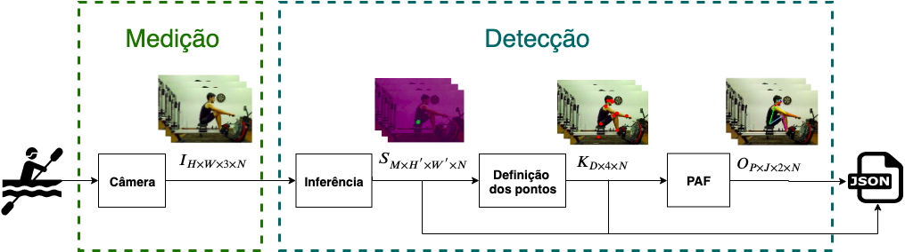

# Automatic Rowing Biomechanics Analysis

Project using Openpose as a markerless pose estimation tool along with addition processing, in order to acquire biomechanical parameters such as stroke cadence and body angulations.

The project consists of mainly three steps, presented in the diagram below

The result of the processing is 

