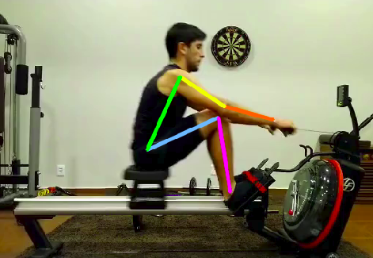
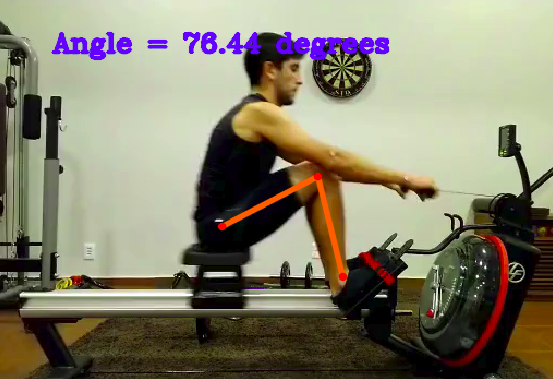
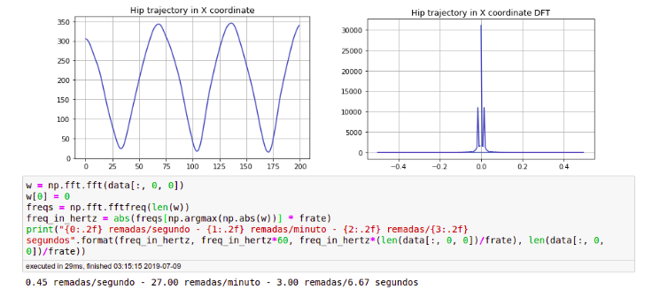

# Automatic Rowing Biomechanics Analysis

Project (under development) using Openpose as a markerless pose estimation tool along with addition processing, in order to acquire biomechanical parameters such as stroke cadence and body angulations.

The project consists of mainly three steps, presented in the diagram below:

  

The result of the processing is depicted in the following image, indicating the main joints of interest in the sagittal plane. 

Then, using those joint coordinates acquired, angles are deduced: 
 

Finally, the velocity can be estimated by separation the x coordinate component from the hip joint coordinate, such as:

The next steps are to improve the joint localization by means of a kinematic chain embedded in a Kalman filter.
